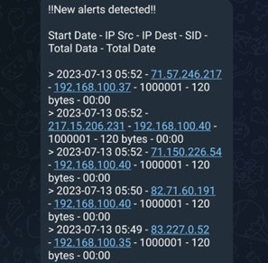

# Snort Bittorrent Detection

## Tujuan
Proyek ini bertujuan untuk membuat sistem yang dapat mendeteksi kegiatan torrenting pada jaringan menggunakan snort, MySQL, barnyard2, dan bot telegram. Jika sistem menemukan paket yang mengandung protokol bittorrent, maka sistem akan mengirim pesan ke channel telegram yang berisi informasi tanggal, waktu, alamat IP sumber, alamat IP tujuan, SID, total data, dan durasi paket bittorrent yang ditangkap oleh snort.

## Persyaratan
Untuk menjalankan sistem ini, Anda memerlukan:

- VirtualBox
- Ubuntu Server 20.04
- Snort
- MySQL
- Barnyard2
- Transmission daemon
- Bot telegram
- Channel telegram
- Skrip bash

## Cara Instalasi
Langkah-langkah untuk menginstal sistem ini adalah sebagai berikut:

### VirtualBox
Buat dua virtual machine (VM) menggunakan VirtualBox, satu untuk snort dan satu untuk klien. Pastikan kedua VM terhubung ke jaringan yang sama dan dapat saling berkomunikasi. Aktifkan mode promiscuous pada VM snort agar dapat menangkap semua paket yang lewat di jaringan. Lalu Install Ubuntu Server 20.04 pada kedua VM.
### Snort 
1. Buka terminal pada VM snort dan jalankan perintah `sudo apt update` untuk memperbarui daftar paket yang tersedia.
2. Jalankan perintah `sudo apt install snort` untuk menginstal Snort dan dependensinya dari repository Ubuntu.
3. Saat proses instalasi berlangsung, Anda akan diminta untuk memasukkan beberapa informasi, seperti nama interface jaringan yang akan dimonitor oleh Snort, rentang alamat IP yang akan dimonitor, dan level aturan yang akan digunakan. Masukkan informasi sesuai dengan kebutuhan Anda atau biarkan nilai default jika tidak yakin.
4. Setelah proses instalasi selesai, Anda dapat memeriksa versi Snort yang terinstal dengan perintah `snort -V`. Anda juga dapat melihat file konfigurasi Snort di `/etc/snort/snort.conf` dan mengeditnya sesuai kebutuhan.

## MySQL
1. Buka terminal pada VM snort dan jalankan perintah `sudo apt update` untuk memperbarui daftar paket yang tersedia.
2. Jalankan perintah `sudo apt install mysql-server` untuk menginstal MySQL dan dependensinya dari repository Ubuntu.
3. Saat proses instalasi berlangsung, Anda akan diminta untuk memasukkan beberapa informasi, seperti nama interface jaringan yang akan dimonitor oleh Snort, rentang alamat IP yang akan dimonitor, dan level aturan yang akan digunakan. Masukkan informasi sesuai dengan kebutuhan Anda atau biarkan nilai default jika tidak yakin.
4. Setelah proses instalasi selesai, Anda dapat memeriksa versi MySQL yang terinstal dengan perintah `mysql -V`. Anda juga dapat melihat file konfigurasi MySQL di `/etc/mysql/my.cnf` dan mengeditnya sesuai kebutuhan.

### Barnyard2
1. Buka terminal pada VM snort dan jalankan perintah `sudo apt update` untuk memperbarui daftar paket yang tersedia.
2. Jalankan perintah `sudo apt install git libmysqlclient-dev libpcap-dev libdumbnet-dev` untuk menginstal dependensi yang dibutuhkan oleh Barnyard2.
3. Jalankan perintah `git clone -b stable https://github.com/firnsy/barnyard2.git` untuk mengunduh kode sumber Barnyard2 dari GitHub dari branch stable.
4. Arahkan direktori barnyard2 yang berisi file instalasi dengan perintah `cd barnyard2`.
5. Jalankan perintah `./autogen.sh` untuk membuat file konfigurasi.
6. Jalankan perintah `./configure --with-mysql --with-mysql-libraries=/usr/lib/x86_64-linux-gnu` untuk mengkonfigurasi Barnyard2 dengan opsi MySQL.
7. Jalankan perintah `make` untuk mengkompilasi kode sumber Barnyard2.
8. Jalankan perintah `sudo make install` untuk menginstal Barnyard2.
9. Terakhir jalankan perintah `ldconfig`, karena kita membuat library sistem baru, kita harus memperbarui cache library yang dipakai oleh sistem.

## Cara Penggunaan
Langkah-langkah untuk menggunakan sistem ini adalah sebagai berikut:

1. Konfigurasikan snort dengan mengedit file `/etc/snort/snort.conf`. Ubah nilai `HOME_NET` dan `EXTERNAL_NET` sesuai dengan jaringan Anda. Tambahkan baris `output unified2: filename snort.u2, limit 128` di bagian output plugins untuk menghasilkan file output yang dapat dibaca oleh barnyard2. Tambahkan baris `include $RULE_PATH/bittorrent.rules` di bagian rules untuk memasukkan aturan yang akan mendeteksi protokol bittorrent.
2. Buat file `/etc/snort/rules/bittorrent.rules` yang berisi aturan berikut:

```
alert tcp any any -> any any (msg:"Bittorrent detected"; content:"BitTorrent protocol"; offset:0; depth:20; sid:1000001; rev:1;)
```

Aturan ini akan mencocokkan paket TCP yang memiliki konten "BitTorrent protocol" di 20 byte pertama payloadnya.

3. Konfigurasikan MySQL dengan membuat database bernama `snort` dan user bernama `snort` dengan password `MYPASSWORD`. Berikan hak akses `create`, `insert`, `select`, `delete`, dan `update` kepada user tersebut terhadap database `snort`. Anda dapat menggunakan perintah berikut:

```
mysql -u root -p
create database snort;
create user 'snort'@'localhost' identified by 'MYPASSWORD';
grant create, insert, select, delete, update on snort.* to 'snort'@'localhost';
exit;
```

4. Konfigurasikan barnyard2 dengan mengedit file `/etc/snort/barnyard2.conf`. Ubah baris `output database: log, mysql, user=snort password=test dbname=snort host=localhost` menjadi `output database: log, mysql, user=snort password=MYPASSWORD dbname=snort host=localhost`. Pastikan password sesuai dengan yang Anda buat sebelumnya.
5. Buat skrip bash yang akan menjalankan snort dan barnyard2, serta mengirim pesan ke channel telegram jika ditemukan torrenting. Anda dapat menggunakan skrip berikut sebagai contoh:

```
#!/bin/bash

CURRENT_DATA=0
# Set the variables
username="snort"
password="MYPASSWORD"
hostname="localhost"
database_name="snort"
chat_id="@channel"
token="62455:AAEkQXs"

# Get the current number of data from the database
CURRENT_DATA=$(mysql -s -u "$username" -p"$password" -h "$hostname" -D "$database_name" -e "SELECT COUNT(*) FROM event;")

# Send Alert Function
function sendAlert
{
# Query the database for the latest alerts
ALERTS=$(mysql -s -u "$username" -p"$password" -h "$hostname" -D "$database_name" -e "SELECT DATE_FORMAT(event.timestamp, '%Y-%m-%d %H:%i') 
AS date_minute, INET_NTOA(iphdr.ip_src) AS ip_src, INET_NTOA(iphdr.ip_dst) AS ip_dst, signature.sig_sid AS sid, SUM(iphdr.ip_len) AS total_data, 
TIME_FORMAT(TIMEDIFF(MAX(event.timestamp), MIN(event.timestamp)), '%H:%i') AS date_hour_diff FROM event JOIN signature ON event.signature=signature.sig_id 
JOIN iphdr ON event.cid=iphdr.cid AND event.sid=iphdr.sid GROUP BY iphdr.ip_src ORDER BY event.timestamp DESC;")
# Format the message to be sent to telegram as a list table
TEXT="!!New alerts detected!!%0A%0AStart Date - IP Src - IP Dest - SID - Total Data - Total Date%0A"
# Loop through each alert and append it to the message
while read -r ALERT; do
   START_DATE=$(echo "$ALERT" | cut -f 1)
   IP_SRC=$(echo "$ALERT" | cut -f 2)
   IP_DST=$(echo "$ALERT" | cut -f 3)
   SID=$(echo "$ALERT" | cut -f 4)
   TOTAL_DATA=$(echo "$ALERT" | cut -f 5)
   TOTAL_TIME=$(echo "$ALERT" | cut -f 6)
   TEXT="$TEXT%0A> $START_DATE - $IP_SRC - $IP_DST - $SID - $TOTAL_DATA bytes - $TOTAL_TIME"
done <<< "$ALERTS"
# Send the message to telegram using curl
curl -s -X POST https://api.telegram.org/bot$token/sendMessage -d chat_id=$chat_id -d text="$TEXT" > /dev/null
}

# Loop forever
while true; do
    # Get the latest number of data from the database
    LATEST_DATA=$(mysql -s -u "$username" -p"$password" -h "$hostname" -D "$database_name" -e "SELECT COUNT(*) FROM event;")
    if [[ $LATEST_DATA -gt $CURRENT_DATA ]]; then
        sendAlert
        echo "Alert sent!"
        CURRENT_DATA=$LATEST_DATA
        sleep 1
    fi
    sleep 5
done
```

Simpan skrip ini dengan nama `snort-bittorrent-detection.sh` dan berikan izin eksekusi dengan perintah `chmod +x snort-bittorrent-detection.sh`. Skrip bash ini adalah sistem yang dapat mendeteksi dan mengirimkan informasi tentang paket-paket yang menggunakan protokol bittorrent pada jaringan ke channel telegram. Skrip ini terhubung ke database MySQL yang menyimpan data paket yang ditangkap oleh snort dan barnyard2, serta ke API telegram yang digunakan untuk mengirim pesan. Skrip ini memiliki fungsi sendAlert yang membuat pesan berupa tabel yang berisi tanggal, waktu, alamat IP sumber, alamat IP tujuan, SID, total data, dan durasi paket bittorrent. Skrip ini juga melakukan looping selamanya dan memeriksa apakah ada data paket baru di database. Jika ada, maka skrip ini akan memanggil fungsi sendAlert untuk mengirim pesan ke channel telegram.

6. Jalankan skrip bash dengan perintah `bash ./snort-bittorrent-detection.sh` atau `bash lokasi_file`. 

## Hasil
Berikut adalah contoh hasil dari sistem ini:



Gambar di atas menunjukkan bahwa sistem berhasil mendeteksi kegiatan torrenting pada jaringan dan mengirim pesan ke channel telegram. Pesan tersebut berisi tanggal, waktu, alamat IP sumber, alamat IP tujuan, SID, total data, dan durasi paket bittorrent yang ditangkap oleh snort.
